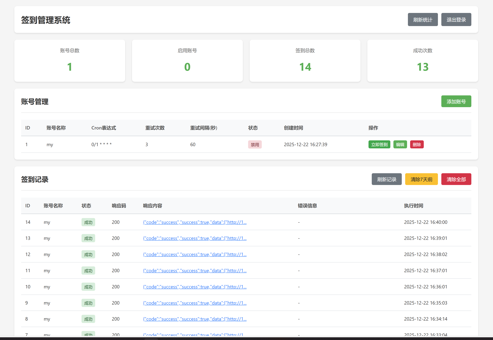

# 签到管理系统 (ACGO)

一个轻量级的自动签到管理系统，支持通过 Curl 命令配置签到任务，使用 Cron 表达式定时执行。

## 功能特性

- ✅ **Curl 命令支持**：直接粘贴浏览器复制的 curl 命令，自动解析
- ✅ **定时任务**：使用 Cron 表达式灵活配置执行时间
- ✅ **失败重试**：可配置重试次数和重试间隔
- ✅ **密码保护**：Web 界面需要密码登录
- ✅ **签到记录**：完整的签到日志记录
- ✅ **手动触发**：支持立即执行签到
- ✅ **轻量级**：基于 SQLite，无需额外数据库

## 技术栈

- **后端**：Flask 3.0
- **定时任务**：APScheduler 3.10
- **数据库**：SQLite + Peewee ORM
- **HTTP 请求**：Requests（自定义 Curl 解析器）
- **前端**：原生 HTML/CSS/JavaScript
- **容器化**：Docker（多平台支持：amd64/arm64）

## 实例


## 快速开始

### 方式 1：Docker 部署（推荐）

#### 使用 GHCR 预构建镜像（最快）

直接使用 GitHub Container Registry 的预构建镜像，无需本地构建：

```bash
# 拉取最新镜像（支持 amd64 和 arm64）
docker pull ghcr.io/your-username/acgo:latest

# 运行容器
docker run -d \
  --name acgo \
  -p 5000:5000 \
  -v $(pwd)/data:/app/data \
  -e ADMIN_PASSWORD=acgo123321 \
  ghcr.io/your-username/acgo:latest

# 访问系统
# 浏览器打开 http://localhost:5000
# 默认密码：acgo123321
```

**可用标签：**
- `latest` - 最新稳定版本
- `v1.0.0` - 指定版本号
- `20231223120000` - 时间戳版本
- `sha-abc1234` - Git commit 版本

#### 使用 Docker Compose（最简单）

```bash
# 1. 克隆或下载项目
git clone <repository-url>
cd acgo

# 2. 启动服务
docker-compose up -d

# 3. 访问系统
# 浏览器打开 http://localhost:5000
# 默认密码：acgo123321
```

#### 使用 Docker 命令

```bash
# 1. 构建镜像
docker build -t acgo:latest .

# 2. 运行容器
docker run -d \
  --name acgo \
  -p 5000:5000 \
  -v $(pwd)/data:/app/data \
  -e ADMIN_PASSWORD=acgo123321 \
  acgo:latest

# 3. 查看日志
docker logs -f acgo
```

#### 自定义配置

编辑 `docker-compose.yml` 中的环境变量：

```yaml
environment:
  - ADMIN_PASSWORD=your_password  # 修改管理员密码
  - SECRET_KEY=your_secret_key    # 修改密钥（可选）
```

### 方式 2：本地部署

#### 1. 安装依赖

```bash
pip install -r requirements.txt
```

#### 2. 配置环境变量（可选）

复制 `.env.example` 为 `.env` 并修改配置：

```bash
cp .env.example .env
```

编辑 `.env` 文件：

```env
# 管理员密码（可选，默认：acgo123321）
ADMIN_PASSWORD=your_secure_password

# Flask 密钥（可选，已有安全默认值）
SECRET_KEY=your-random-secret-key
```

#### 3. 启动服务

```bash
python app.py
```

**注意**：首次启动时会自动创建数据库和表结构，无需手动初始化。

服务将在 `http://0.0.0.0:5000` 启动。

#### 4. 访问系统

打开浏览器访问 `http://localhost:5000`，使用配置的密码登录（默认：acgo123321）。

## 使用说明

### 添加签到账号

1. 点击"添加账号"按钮
2. 填写账号名称
3. 粘贴完整的 curl 命令（从浏览器开发者工具复制）
4. 配置 Cron 表达式（例如：`0 8 * * *` 表示每天 8 点）
5. 设置重试次数和重试间隔
6. 保存

### Curl 命令示例

```bash
curl 'https://api.example.com/checkin' \
  -H 'Authorization: Bearer your_token' \
  -H 'Content-Type: application/json' \
  --data-raw '{"user_id": 123}'
```

### Cron 表达式说明

格式：`分 时 日 月 周`

常用示例：
- `0 8 * * *` - 每天 8:00
- `0 */6 * * *` - 每 6 小时
- `0 0 * * 0` - 每周日 0:00
- `30 9 1 * *` - 每月 1 号 9:30

## 项目结构

```
acgo/
├── app.py              # Flask 主程序
├── models.py           # 数据库模型
├── auth.py             # 认证模块
├── scheduler.py        # 定时任务调度
├── requirements.txt    # 依赖清单
├── .env.example        # 环境变量示例
├── templates/          # HTML 模板
│   ├── login.html      # 登录页
│   └── index.html      # 主界面
├── static/             # 静态资源
│   └── style.css       # 样式文件
└── acgo.db             # SQLite 数据库（自动生成）
```

## API 接口

### 账号管理

- `GET /api/accounts` - 获取账号列表
- `POST /api/accounts` - 创建账号
- `PUT /api/accounts/<id>` - 更新账号
- `DELETE /api/accounts/<id>` - 删除账号

### 签到操作

- `POST /api/checkin/<id>` - 手动立即签到
- `GET /api/logs` - 获取签到记录
- `GET /api/stats` - 获取统计数据

## 注意事项

1. **密码安全**：务必修改默认密码
2. **Curl 命令**：确保包含完整的请求头和请求体
3. **时区问题**：Cron 表达式使用服务器本地时区
4. **日志清理**：签到日志会持续累积，建议定期清理

## CI/CD 自动构建

项目使用 GitHub Actions 自动构建并推送 Docker 镜像到 GHCR。

### 触发条件

- **Push 到 main/master 分支**：自动构建并推送 `latest` 标签
- **创建版本标签**（如 `v1.0.0`）：自动构建并推送版本标签
- **Pull Request**：仅构建测试，不推送镜像

### 多平台支持

自动构建支持以下平台：
- `linux/amd64` - x86_64 架构（常规服务器、PC）
- `linux/arm64` - ARM64 架构（树莓派 4、Apple Silicon、ARM 服务器）

### 发布新版本

```bash
# 1. 创建版本标签
git tag v1.0.0

# 2. 推送标签到 GitHub
git push origin v1.0.0

# 3. GitHub Actions 自动构建并推送镜像
# 镜像地址：ghcr.io/your-username/acgo:v1.0.0
```

### 查看构建状态

访问仓库的 Actions 标签页查看构建进度和日志。

### 镜像可见性设置

首次推送后，GHCR 包默认是私有的。如需公开访问：

1. 访问 `https://github.com/your-username?tab=packages`
2. 点击 `acgo` 包
3. 点击 "Package settings"
4. 在 "Danger Zone" 中选择 "Change visibility" → "Public"

## 常见问题

### Q: 如何获取 Curl 命令？

A: 
1. 打开浏览器开发者工具（F12）
2. 切换到 Network 标签
3. 手动执行一次签到操作
4. 找到对应的请求，右键选择 "Copy as cURL"

### Q: 签到失败怎么办？

A: 
1. 检查 Curl 命令是否完整
2. 检查 Token 是否过期
3. 查看签到记录中的错误信息
4. 尝试手动执行一次签到

### Q: 如何修改定时任务？

A: 直接在账号管理中点击"编辑"，修改 Cron 表达式后保存即可。

## 许可证

MIT License

## 贡献

欢迎提交 Issue 和 Pull Request！
