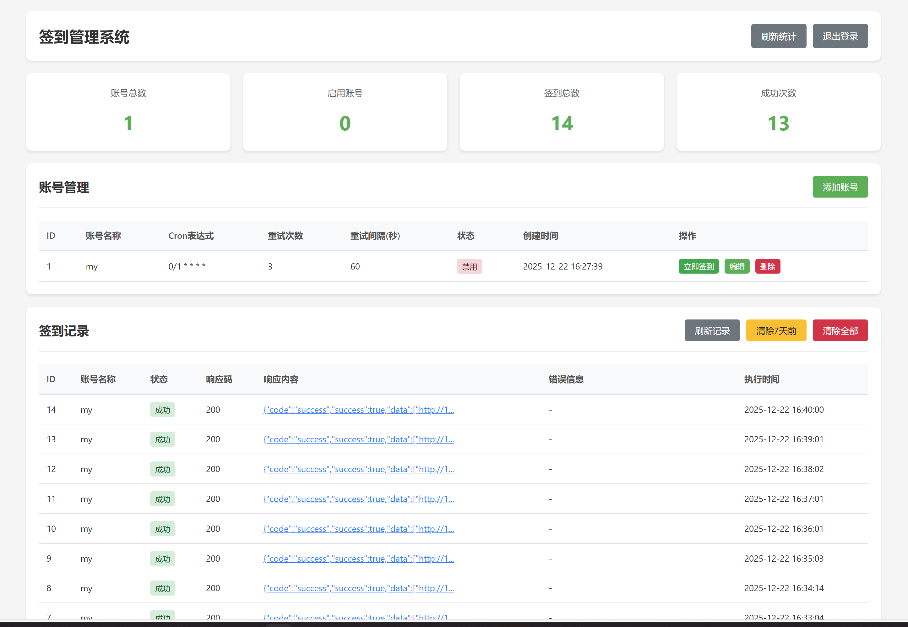

# 签到管理系统 (ACGO)

当前版本：**v2.0.0**。变更及升级说明见 [CHANGELOG](CHANGELOG.md)。

一个轻量级的自动签到管理系统，支持通过 Curl 命令配置签到任务，使用 Cron 表达式定时执行。

## 功能特性

- ✅ **Curl 命令支持**：直接粘贴浏览器复制的 curl 命令，自动解析
- ✅ **定时任务**：使用 Cron 表达式灵活配置执行时间
- ✅ **随机时间窗口**：支持在指定时间段内随机执行签到（如 9:00-9:30）
- ✅ **失败重试**：可配置重试次数和重试间隔
- ✅ **密码保护**：Web 界面需要密码登录，支持在线修改密码
- ✅ **签到记录**：完整的签到日志记录，支持分页查看
- ✅ **自动清理**：可配置自动清理旧的签到记录
- ✅ **手动触发**：支持立即执行签到
- ✅ **账号导入导出**：支持批量导入导出账号配置
- ✅ **Webhook 通知**：支持签到完成后的 Webhook 回调通知
- ✅ **系统设置**：Web 界面管理所有系统配置
- ✅ **轻量级**：基于 SQLite，无需额外数据库

## 1 核 1G 部署

建议使用仓库中的 `docker-compose.yml`，默认限制容器为 1 CPU / 640MiB、128 个进程/线程，并配置日志轮转。默认拉取 `ghcr.io/yz0812/acgo:2.0.0` 预构建镜像，无需在服务器上编译。Linux 下载配置并启动的命令见下文；升级版本时修改 `.env` 中的 `ACGO_IMAGE`，再执行 `docker compose up -d --pull always`。

- **唯一入口**：`python run.py` 使用生产级 Waitress；数据库初始化和调度器不在模块导入时启动。数据目录有进程锁，不能启用多个实例共用同一目录。
- **执行额度**：默认 2 个 HTTP 工作线程、1 个脚本工作线程，最多 32 个未完成任务。手动和定时共用队列，同一账号的重复提交返回现有执行 ID。
- **等待与重试**：等待状态保存在 SQLite，重试不占线程。重启后继续等待中的任务；执行中崩溃的任务标记为 `interrupted` 并写日志，避免自动重放造成重复签到。配置修改会取消旧待执行项；已发出的外部请求无法撤回。
- **通知**：独立持久化队列，按渠道最多重试 3 次；通知失败不会再次执行签到。通知处于“发送成功但还未落库”时崩溃，恢复后可能重复发送该渠道。
- **响应限制**：HTTP 单次读取上限默认 128KiB，同时限制压缩前后的字节数；最多跟随 5 次重定向。日志保存最多 5000 字符，完整详情按需加载。
- **脚本限制**：默认 60 秒、进程树 RSS 监测额度 192MiB、最多 8 个进程，输出通过管道有界读取。Node.js 堆额度默认 96MiB。Linux 另有限制 CPU 时间、文件描述符和 Python 地址空间。
- **内存边界**：RSS 是每 20ms 采样的终止条件，不是内核硬上限；Python 地址空间/Node 堆上限也不等于总 RSS。需要严格的脚本进程树内存上限时，配置已委派的 cgroup v2 目录 `SCRIPT_CGROUP_ROOT`（需 memory/pids 控制器）；配置不可用时脚本拒绝启动。Compose 的 640MiB 是整个容器硬上限。
- **日志与数据库**：WAL + 显式索引，默认保留 500 条日志；每 10 秒以 200 行一批清理，每轮最多工作约 1 秒。已有数据库的日志开关会保留，升级后在系统设置中确认开启。正常停止后再复制数据目录备份。
- **导入导出**：服务端分批读取导出；页面自动分批导入，每个请求最多 100 个账号且正文最多 2MiB。

资源参数见 `.env.example`。新增的资源参数每次启动读取，数据库中的密码、日志开关等业务配置仍通过页面维护。API 返回形状与手动执行方式已有变化，外部调用方需按上面的接口说明适配。

验证命令：

```bash
python -m unittest discover -s tests -v
python tests/benchmark_profile.py
```

第二个命令使用临时数据库和本地模拟接口，将被测服务及其脚本子进程限制到一个逻辑 CPU，打印进程树 RSS 与请求延迟，不执行真实签到。实测结果与边界见 [性能验证记录](docs/performance.md)。

## 技术栈

- **后端**：Flask 3.0 + Waitress（单进程、默认 4 个请求线程）
- **定时任务**：APScheduler 3.10
- **数据库**：SQLite + Peewee ORM
- **HTTP 请求**：Requests（自定义 Curl 解析器）
- **前端**：原生 HTML/CSS/JavaScript
- **容器化**：Docker（多平台支持：amd64/arm64）

## 实例


## 快速开始

### 方式 1：Docker 部署（推荐）

#### Linux：一键部署脚本（推荐）

服务器需已安装 [Docker Engine](https://docs.docker.com/engine/install/)、新版 [Compose 插件](https://docs.docker.com/compose/install/linux/)（支持 `--wait` / `--wait-timeout`）和 `curl`，当前用户需有 Docker 使用权限。

从 GitHub Raw 下载脚本并执行，即可完成部署，无需克隆源码或手动创建配置：

```bash
curl -fL --retry 3 https://raw.githubusercontent.com/yz0812/acGo/main/deploy.sh -o deploy.sh && sh deploy.sh
```

脚本默认部署到 `/data/acgo`，自动下载 `docker-compose.yml` 和 `.env.example`，生成 `.env`、随机管理员密码及会话密钥，然后拉取镜像并启动服务。健康检查通过后显示访问地址和首次生成的密码；密码也保存在权限为 `600` 的 `.env` 中。依赖缺失、下载失败或服务启动失败时，脚本返回错误。

默认目录需要当前用户有创建和写入权限；也可以指定其他部署目录：

```bash
sh deploy.sh /opt/acgo
```

重复执行会保留已有 `docker-compose.yml`、`.env` 和 `data`，继续使用原配置启动服务。已有数据库的管理员密码保持不变。

浏览器访问 `http://服务器IP:5000`，使用脚本输出的初始化密码登录；远程访问需在服务器防火墙/安全组放行 TCP 5000。默认数据库目录为 `/data/acgo/data`。

常用管理命令（在 `/data/acgo` 目录执行）：

```bash
docker compose ps           # 查看容器及健康状态
docker compose logs -f --tail=100  # 查看日志
docker compose down         # 停止并移除容器，保留 ./data
# 修改 .env 后重新创建容器，使环境变量生效
docker compose up -d --force-recreate
```

Compose 默认固定使用 `2.0.0` 镜像；升级时先正常停止服务并备份 `data`，将 `.env` 中的 `ACGO_IMAGE` 改为已发布的新镜像版本，再执行启动命令。管理员密码、日志开关等业务配置仅在首次初始化数据库时从环境变量读取，已有部署请在页面“系统设置”中修改。

如果需要从源码构建，在克隆的项目目录中准备 `.env` 后执行（建议在开发机上构建）：

```bash
[ -f .env ] || cp .env.example .env
docker build -t acgo:local .
ACGO_IMAGE=acgo:local docker compose up -d --pull never
```

#### 使用 GHCR 预构建镜像（最快）

直接使用 GitHub Container Registry 的预构建镜像，无需本地构建：

```bash
# 拉取最新镜像（支持 amd64 和 arm64）
docker pull ghcr.io/yz0812/acgo:latest

# 运行容器
docker run -d \
  --name acgo \
  -p 5000:5000 \
  -v $(pwd)/data:/app/data \
  -e ADMIN_PASSWORD=acgo123321 \
  -e AUTO_CLEAN_LOGS=true \
  -e MAX_LOGS_COUNT=500 \
  ghcr.io/yz0812/acgo:latest

# 访问系统
# 浏览器打开 http://localhost:5000
# 默认密码：acgo123321
```

**可用标签：**
- `latest` - 最新稳定版本
- `2.0.0` - 指定镜像版本（对应 Git 标签 `v2.0.0`）
- `20231223120000` - 时间戳版本
- `sha-abc1234` - Git commit 版本

#### 使用 Docker 命令

```bash
# 1. 构建镜像
docker build -t acgo:latest .

# 2. 运行容器
docker run -d \
  --name acgo \
  -p 5000:5000 \
  -v $(pwd)/data:/app/data \
  -e ADMIN_PASSWORD=acgo123321 \
  -e AUTO_CLEAN_LOGS=true \
  -e MAX_LOGS_COUNT=500 \
  acgo:latest

# 3. 查看日志
docker logs -f acgo
```

#### 自定义配置

编辑 `.env`，Compose 会通过 `env_file` 将配置传入容器：

```env
ADMIN_PASSWORD=your_password
SECRET_KEY=your_random_secret_key
ACGO_IMAGE=ghcr.io/yz0812/acgo:2.0.0
```

修改后执行 `docker compose up -d --force-recreate`。

### 方式 2：本地部署

#### 1. 安装依赖

```bash
pip install -r requirements.txt
```

#### 2. 配置环境变量（可选）

复制 `.env.example` 为 `.env` 并修改配置：

```bash
cp .env.example .env
```

编辑 `.env` 文件：

```env
# 管理员密码（可选，默认：acgo123321）
ADMIN_PASSWORD=your_secure_password

# Flask 密钥（可选，已有安全默认值）
SECRET_KEY=your-random-secret-key

# 自动清理签到记录（可选，新数据库默认：true）
# 设置为 true 启用自动清理，每 10 秒分批执行
AUTO_CLEAN_LOGS=true

# 最大签到记录数（可选，默认：500）
# 当启用自动清理时，保留最新的 N 条记录
MAX_LOGS_COUNT=500
```

**注意**：首次启动后，所有配置（包括密码）都会保存到数据库中，后续可以通过 Web 界面的"系统设置"进行修改，无需再修改环境变量。

#### 3. 启动服务

Windows 用户可双击项目根目录的 `start.bat`，自动激活 `venv`（不存在时尝试 `.venv`）并启动服务，也可在 PowerShell 中运行 `./start.bat`。首次使用需先创建虚拟环境并安装依赖：

```powershell
python -m venv venv
.\venv\Scripts\python.exe -m pip install -r requirements.txt
```

其他平台或手动启动：

```bash
python run.py
```

**注意**：首次启动时会自动创建数据库和表结构，无需手动初始化。

服务将在 `http://0.0.0.0:5000` 启动。

#### 4. 访问系统

打开浏览器访问 `http://localhost:5000`，使用配置的密码登录（默认：acgo123321）。

## 使用说明

### 添加签到账号

1. 点击"添加账号"按钮
2. 填写账号名称
3. 选择执行方式：Curl 命令、JavaScript 脚本或 Python 脚本，填写内容；可展开 Demo 或点击“填入示例”
4. 配置 Cron 表达式（例如：`0 8 * * *` 表示每天 8 点）
5. 设置重试次数和重试间隔
6. 保存

### 脚本任务

添加和编辑账号均支持切换执行方式，已有账号默认仍为 Curl。三种方式共用 Cron、随机时间窗口、失败重试和通知配置；导入导出也会保留执行方式与脚本。

| 方式 | 运行环境 | 成功条件 |
|------|----------|----------|
| Curl | 内置 HTTP 请求执行器 | HTTP 状态码为 2xx |
| JavaScript | 服务端 Node.js；页面示例需要 Node.js 18+ | 进程退出码为 0 |
| Python | 启动服务所用的 Python / 虚拟环境 | 进程退出码为 0 |

Windows 本地使用 JavaScript 前需安装 Node.js，并确保 `node --version` 可用，然后重启服务。两个 Dockerfile 均已加入 Node.js，已有镜像需要重新构建。

脚本在独立进程和临时工作目录中运行，单次最多 60 秒，输出超过 128 KiB 会判为失败；签到日志最多保存 5000 字符，并显示退出码、错误信息及当次脚本。超时或非零退出码会按重试配置再次运行。业务接口返回失败时，脚本需要主动抛出异常或设置非零退出码；仅打印“失败”不会将任务标为失败。

脚本以服务账号权限执行，不是安全沙箱，仅运行可信代码。临时目录会在执行后清理；需要持久化文件时请使用明确的绝对路径。Python 可使用当前虚拟环境中的依赖，JavaScript 示例使用 Node.js 内置 API，不会自动安装第三方包。

页面中的三种 Demo 请求 `https://httpbin.org/get`，用于演示 HTTP 调用，并非真实签到接口。实际使用时请替换地址、认证信息和业务成功判断。以下是不访问网络、可直接手动执行的脚本示例：

```javascript
// JavaScript：console.log 输出到签到日志；抛出 Error 表示失败。
console.log(JSON.stringify({success: true, message: "JavaScript 脚本执行成功"}));
```

```python
# Python：print 输出到签到日志；抛出异常表示失败。
import json
print(json.dumps({"success": True, "message": "Python 脚本执行成功"}, ensure_ascii=False))
```

### Curl 命令示例

```bash
curl 'https://api.example.com/checkin' \
  -H 'Authorization: Bearer your_token' \
  -H 'Content-Type: application/json' \
  --data-raw '{"user_id": 123}'
```

### Cron 表达式说明

支持两种格式：

#### 1. 标准 Cron 表达式

格式：`分 时 日 月 周`

常用示例：
- `0 8 * * *` - 每天 8:00 执行
- `0 */6 * * *` - 每 6 小时执行
- `0 0 * * 0` - 每周日 0:00 执行
- `30 9 1 * *` - 每月 1 号 9:30 执行
- `30 14 * * 1-5` - 每周一到周五 14:30 执行

#### 2. 随机时间窗口（新功能）

格式：`R(开始时间-结束时间) 日 月 周`

这个功能可以让签到在指定的时间窗口内随机执行，避免固定时间签到被检测。

常用示例：
- `R(09:00-09:30) * * *` - 每天 9:00-9:30 之间随机执行
- `R(08:00-08:15) * * 1-5` - 每周一到周五 8:00-8:15 随机执行
- `R(20:00-22:00) 1 * *` - 每月 1 号 20:00-22:00 随机执行
- `R(07:00-07:10) * * 0,6` - 每周六日 7:00-7:10 随机执行

**工作原理**：系统在窗口开始时计算随机执行时间，将待执行项持久化到 SQLite；等待期间不占用任务线程。

## 项目结构

```
acgo/
├── app.py              # Flask 主程序
├── models.py           # 数据库模型
├── auth.py             # 认证模块
├── scheduler.py        # 定时任务调度
├── requirements.txt    # 依赖清单
├── .env.example        # 环境变量示例
├── templates/          # HTML 模板
│   ├── login.html      # 登录页
│   └── index.html      # 主界面
├── static/             # 静态资源
│   └── style.css       # 样式文件
└── acgo.db             # SQLite 数据库（自动生成）
```

## API 接口

### 账号管理

- `GET /api/accounts?page=1&page_size=20` - 分页账号摘要（不含 Curl/脚本正文）
- `GET /api/accounts/<id>` - 单个账号完整配置
- `POST /api/accounts` - 创建账号
- `PUT /api/accounts/<id>` - 更新账号
- `DELETE /api/accounts/<id>` - 删除账号
- `GET /api/accounts/export` - 导出所有账号
- `POST /api/accounts/import` - 批量导入账号

### 签到操作

- `POST /api/checkin/<id>` - 提交手动签到，返回 HTTP 202 和执行 ID；队列满返回 429
- `GET /api/executions/<id>` - 查询排队、运行、重试或最终结果
- `GET /api/logs` - 获取签到记录摘要（分页大小 1～100）
- `GET /api/logs/<id>/response` - 获取完整的已保存响应（最多 5000 字符）
- `GET /api/stats` - 获取统计数据
- `DELETE /api/logs/clear` - 清除签到记录

### 系统配置

- `GET /api/system/config` - 获取系统配置
- `POST /api/system/config` - 保存系统配置
- `POST /api/system/password` - 修改管理员密码

### Webhook 配置

- `GET /api/webhook/config` - 获取 Webhook 配置
- `POST /api/webhook/config` - 保存 Webhook 配置
- `POST /api/webhook/test` - 测试 Webhook

## 系统设置

点击右上角的"系统设置"按钮，可以在 Web 界面中管理以下配置：

### 1. 修改管理员密码

- 需要输入旧密码验证
- 新密码至少 6 位
- 修改成功后需要重新登录

### 2. 签到记录自动清理

- **启用自动清理**：开启后，每 10 秒分批清理
- **最大记录数**：保留最新的 N 条签到记录（最小 100 条）
- 超出限制的旧记录会被自动删除

### 3. Webhook 通知

- 支持在签到完成后发送 Webhook 通知
- 可自定义请求方法（POST/GET）和请求头
- 可选择是否包含完整的签到响应内容

## 注意事项

1. **密码安全**：务必修改默认密码，首次启动后可通过"系统设置"修改
2. **Curl 命令**：确保包含完整的请求头和请求体
3. **时区问题**：Cron 表达式使用服务器本地时区
4. **日志清理**：建议启用自动清理功能，避免数据库过大
5. **随机窗口**：使用随机时间窗口时，确保窗口不跨越午夜（暂不支持）
6. **配置持久化**：所有配置保存在数据库中，运行中请使用 SQLite backup API 备份；或先正常停止服务再备份整个 `data/` 目录。WAL 模式下不要在运行中只复制 `acgo.db`

## CI/CD 自动构建

项目使用 GitHub Actions 自动构建并推送 Docker 镜像到 GHCR。

### 触发条件

- **Push 到 main/master 分支**：自动构建并推送 `latest` 标签
- **创建并推送版本标签**（如 `v2.0.0`）：自动构建并推送版本镜像
- **Pull Request**：仅构建测试，不推送镜像

### 多平台支持

自动构建支持以下平台：
- `linux/amd64` - x86_64 架构（常规服务器、PC）
- `linux/arm64` - ARM64 架构（树莓派 4、Apple Silicon、ARM 服务器）

### 发布新版本

```bash
# 1. 创建版本标签
git tag -a v2.0.0 -m "迭代 v2.0.0"

# 2. 推送标签到 GitHub
git push origin v2.0.0

# 3. GitHub Actions 自动构建并推送镜像
# 镜像地址：ghcr.io/yz0812/acgo:2.0.0
```

### 查看构建状态

访问仓库的 Actions 标签页查看构建进度和日志。

### 镜像可见性设置

首次推送后，GHCR 包默认是私有的。如需公开访问：

1. 访问 `https://github.com/your-username?tab=packages`
2. 点击 `acgo` 包
3. 点击 "Package settings"
4. 在 "Danger Zone" 中选择 "Change visibility" → "Public"

## 常见问题

### Q: 如何获取 Curl 命令？

A: 
1. 打开浏览器开发者工具（F12）
2. 切换到 Network 标签
3. 手动执行一次签到操作
4. 找到对应的请求，右键选择 "Copy as cURL"

### Q: 签到失败怎么办？

A: 
1. 检查 Curl 命令是否完整
2. 检查 Token 是否过期
3. 查看签到记录中的错误信息
4. 尝试手动执行一次签到

### Q: 如何修改定时任务？

A: 直接在账号管理中点击"编辑"，修改 Cron 表达式后保存即可。

### Q: 如何使用随机时间窗口？

A: 在添加或编辑账号时，Cron 表达式使用 `R(开始时间-结束时间) 日 月 周` 格式，例如 `R(09:00-09:30) * * *` 表示每天 9:00-9:30 之间随机执行。

### Q: 如何启用自动清理？

A: 点击右上角"系统设置"按钮，勾选"启用自动清理"，设置最大记录数后保存即可。系统会每 10 秒分批清理超出限制的旧记录。

### Q: 如何修改管理员密码？

A: 点击右上角"系统设置"按钮，在"修改管理员密码"区域输入旧密码和新密码，点击"修改密码"即可。修改成功后需要重新登录。

### Q: 如何批量导入账号？

A: 点击"导入账号"按钮，选择之前导出的 JSON 文件即可。重名账号会自动重命名。

## 许可证

MIT License

## 贡献

欢迎提交 Issue 和 Pull Request！
